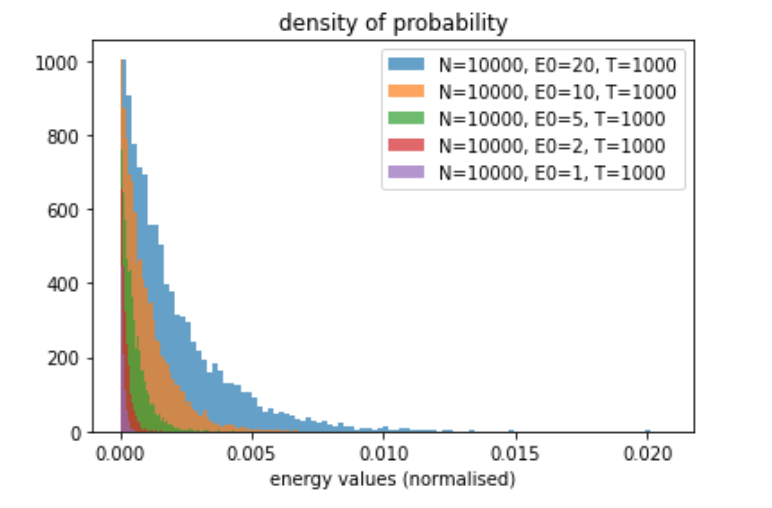

# Boltzmann simulation
## Study of Maxwell-Boltzmann velocity distribution 
Particle-in-a-box (PIB) simulation written in C with C++ graphics animator. Uses event-driven programming. 

Has thermal gradient and mobile vertical wall.

Project done for my computer programming class at ESPCI Paris under supervision from Prof. Didier Cassereau. 

Final grade: A+

### To run
Clone repo:
``` $ git clone https://github.com/jgbrasier/boltzmann-simulation ```

Build main (in repo directory):
``` make ./start```

Run
``` start ```

### Outputs
program outputs a distribution.txt histogram of velocities.

### Parameters

In __main()__:
 - Np (Number of particles): varies number of particles (currently program does not run with Np > 200)
 - diameter (particle diameter): if increase diameter, reduce Np (ther is no adaptive window scaling, you may encounter a run-time error)
 
## Study of the Boltzmann energy distribution

Jupyter Notebook detailing a simple collision model where only the energy of a particle in considered. At each timestep, particles have a probability p of exchanging their energies.




